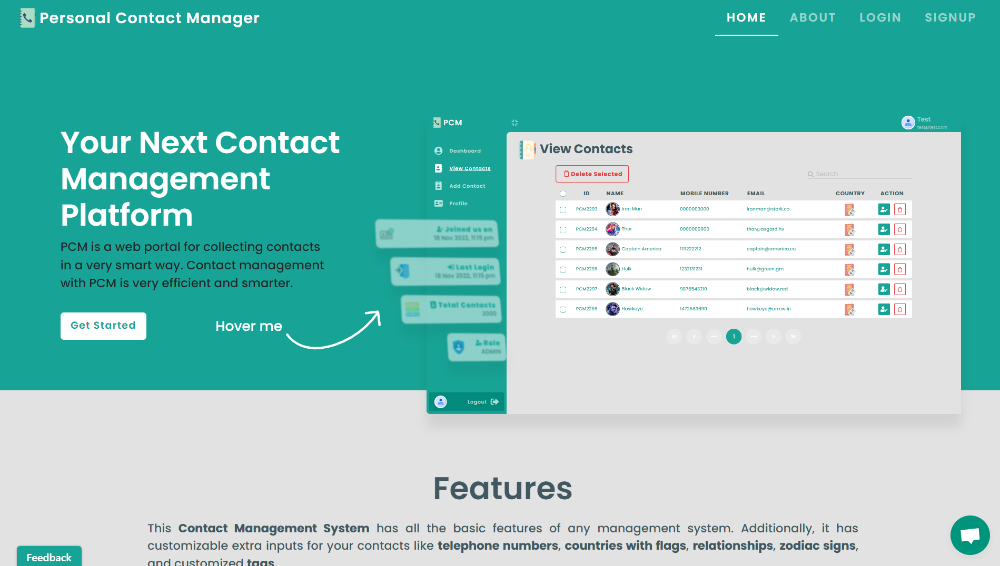
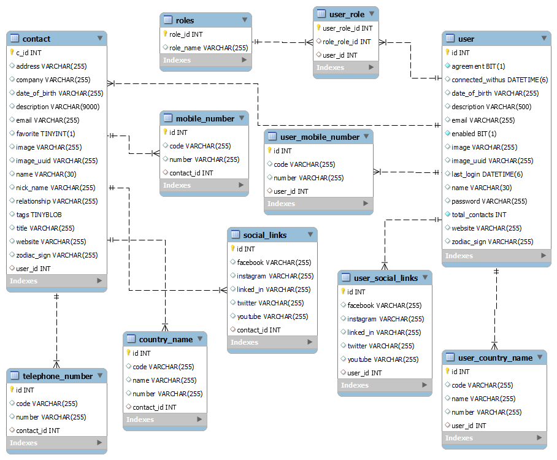
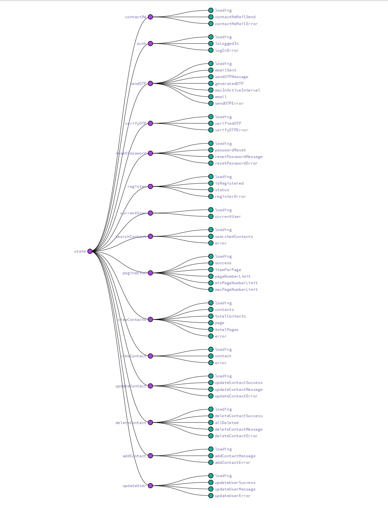

# Personal Contact Manager

PCM is a web portal for collecting contacts in a very smart way. Contact management with PCM is very efficient and smarter.

🌐 Website : [PCM](https://pcm.vercel.app/)

Now you can access the ``demo`` account feel free to explore :)

Must try The demo login. Go [visit now](https://pcm.vercel.app/login)




<br/>

## 📑 About the project
We understand how important your contacts are, and we want to make it easier than ever to organize and manage them all in one place. That's why we built Personal Contact Manager, with a clean, simple design and powerful features that'll take you less than 10 seconds to get up and running.
<br/>

**The most user-friendly address book :**
I designed Personal Contact Manager to be as intuitive as possible so you can spend less time figuring out how to use it and more time managing your contacts. All of the features are laid out in a simple manner that makes it easy for you to manage your contacts from anywhere on any device.
<br/>

**It's all in one place :**
Personal Contact Manager brings together all the information you need about your contacts into one easy-to-use dashboard, so you can find what you need with a single search. It also includes an address book for storing names, addresses and phone numbers of important people.

<br/>

## 🔐 Key Features
  1. Simple and unique ``UI`` & user friendly ``design``
  2. Implemented ``lazy loading`` for better optimization
  3. ``Dual login`` feature (``User`` account and ``Demo`` account)
  4. Secure ``JWT Authentication``
  5. Robust ``Password Encryption`` with [BCryptPasswordEncoder](https://docs.spring.io/spring-security/site/docs/current/api/org/springframework/security/crypto/bcrypt/BCryptPasswordEncoder.html)
  6. Implemented ``Role-Based Authorization``
  7. Simple Informative ``dynamic dashboard`` for every user
  8. Implemented ``skeleton loading`` animation for better visualization
  9. Enhanced ``abort controller quick search`` functionality implemented with axios
  10. Added ``pagination`` for improved accessibility
  11. Flexible Contact Deletion with ``single contact delete`` & ``multiple contact delete`` (batch delete)
  12. Custom ``in-house components`` with styling & features
  13. Comprehensive ``complex contact`` form implementation with different data types and files.
  14. Implemented [formik](https://formik.org/) with custom form ``validation``
  15. Implemented [TinyMCE](https://www.tiny.cloud/) ``rich text editor``
  16. Added country field with ``country flag`` identification
  17. Independent external ``image storage servers`` for better efficiency
  18. Full implementation of ``CRUD`` functionality
  19. Implemented ``forgot password`` module for better useability
  20. Seamlessly ``user logout`` module


<br/>

## 👨🏻‍💻 Developer's Talk
Developed by <a href="https://github.com/debrajhyper">Debraj Karmakar</a>
<span style="display:inline-flex; justify-content:space-evenly; width:20%;">
<a href="https://twitter.com/debraj_010">
  
</a>
<a href="https://linkedin.com/in/debraj-karmakar-275570199">
  
</a>
<a href="https://fb.com/debraj.karmakar.923">
  
</a>
<a href="https://www.behance.net/debrajkarmakar">
  
</a>
</span>

><a href="https://pcm.vercel.app/">This</a> is a small effort from my side to build a medium scale project using React and Spring Boot technologies. The experience taught me so many things, as well as the challenges involved in overcoming problems encountered during the development phase. I consider this project very relevant to me as a full-stack developer. The people who helped me during the development phase are to be commended.

<br/>

    Upcming Features
      - Oauth 2 login with social accounts 

## 🚀 Tech Stack

**💻 Client:** HTML, Axios, Formik, React, React Toastify, React Redux, Redux, Redux Thunk, Redux Logger

**✨ Styles:** SCSS, React Bootstrap, React Icons, React Useanimations, React Loading Skeleton

**🔌 Service:** EmailJs, Tinymce, Ybug, crisp, Uploadcare

**🔐 Security:** Spring Boot Security, Password Encoder, JSON Web Tokens

**🔥 Server:** Java, Spring Boot, Hibernate, Lombok, Mail, JavaX, JPA

**🧲 Validation:** Hibernate Validator Engine, Bean Validation API

**📂 Database:** MySql

<br/>

## ⌛ Hosting

**💻 Client:** [vercel](https://vercel.com/debrajhyper/pcm-client)

**📧 Email Service:** [emailjs](https://dashboard.emailjs.com/admin/statistics)

**👏🏻 Feedback:** [ybug feedback](https://ybug.io/dashboard/projects/2x6n422zws7k9k2rvttq/reports)

**🙂 Chat:** [crisp chat](https://app.crisp.chat/website/edbf0bc6-2c54-4ca8-82d7-5dc4eb967c09/inbox)

**🔥 Server:** [render](https://dashboard.render.com/web/srv-ch4gobm4dad97s327np0)

**🔍 Files Server:** [uploadcare](https://app.uploadcare.com/projects/42f221173ddffa4c7a53/files/fa2bc038-fd07-4096-adfc-02c2c54ac46b?limit=100&ordering=-datetime_uploaded)

**📂 Database:** [aiven](https://console.aiven.io/account/a49e67a78f05/project/debrajkarmakar010-26f0/services/pcm/overview)

**📈 Monitoring:** [Monitoring Services](https://rp60xbp0.status.cron-job.org/)

**➰ Corn Jobs:** [corn jobs](https://console.cron-job.org/dashboard)

<br/>


## 📊 UML Diagram



<br/>

## 🔥 Redux State Tree



<br/>


```
if (_.isAwesome(thisRepo)) {
  thisRepo.star(); // thanks in advance :p
}
```

## 🏃🏻‍♂️ Run Locally

Clone the project
```
  $git clone https://github.com/debrajhyper/Personal-Contact-Manager
```

Go to the project directory
```
  cd PCM
```

Install dependencies
```
  $npm install
```

Start the server
```
  $npm start
```

<br/>
